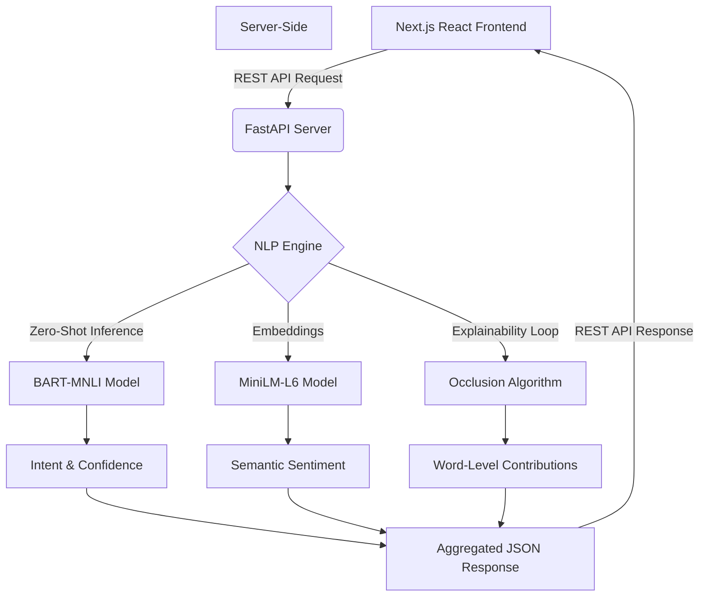

# Semantic Comment Analysis

A production-ready, full-stack application for the deep semantic analysis of customer feedback, support tickets, and open-ended text. The system leverages state-of-the-art transformer models to provide automated intent classification, semantic sentiment scoring, and a unique **Occlusion-based Explainability Engine** that visually highlights how specific vocabulary drives AI decision-making.

## Core NLP Capabilities

### 1. Zero-Shot Intent Classification
Powered by **BART-Large-MNLI** (`facebook/bart-large-mnli`), the system frames intent classification as a Natural Language Inference (NLI) problem. It classifies incoming text against predefined intents without requiring task-specific fine-tuning:
- **Bug Report**
- **Complaint**
- **Feature Request**
- **Praise**
- **Question**

### 2. Multi-Intent Explainability (Occlusion Algorithm)
To eliminate the "black box" nature of Large Language Models, the engine implements a custom occlusion algorithm:
- It iteratively masks (occludes) every single word in a given text.
- It re-runs the classification pipeline for each masked variation.
- By measuring the delta in confidence drops across *all 5 intents simultaneously*, it calculates exactly how much each word pushed or pulled the model toward a specific intent.
- **Result**: A highly detailed, multi-color heatmap where every word glows with the color of the intent it primarily triggered, scaled by its contribution percentage.

### 3. Semantic Sentiment Analysis
Instead of traditional lexicon-based sentiment, the system uses **Sentence Transformers** (`sentence-transformers/all-MiniLM-L6-v2`) to map the text into a dense semantic vector space. 
- It calculates the Cosine Similarity between the input embedding and carefully crafted anchor embeddings (representing "Positive", "Neutral", and "Negative" concepts).
- This results in a highly contextual, continuous sentiment spectrum rather than rigid binary labels.

## Architecture

The application operates on a decoupled client-server architecture, providing a highly responsive Next.js frontend communicating with a high-performance FastAPI Python backend.



### Directory Structure

```text
Semantic-Comment-Analyze/
├── src/
│   ├── api/
│   │   └── server.py         # FastAPI application and endpoint routing
│   ├── engine/
│   │   └── nlp_engine.py     # Transformer models, occlusion, and inference logic
├── frontend/
│   ├── src/
│   │   ├── app/              # Next.js App Router (Layout, Pages)
│   │   └── components/       # React components (Heatmap, Radar, Layouts)
│   ├── tailwind.config.ts    # Design tokens and theming
│   └── package.json          # Node.js dependencies
└── requirements.txt          # Python dependencies
```

## Getting Started

### Prerequisites
- **Python 3.8+**
- **Node.js 18+**
- **4GB+ RAM** (Models are cached locally after the first ~1.7GB download)

### 1. Backend Setup (FastAPI + Transformers)
```bash
# Create and activate a virtual environment
python -m venv .venv
# Windows: .venv\Scripts\activate
# Mac/Linux: source .venv/bin/activate

# Install dependencies
pip install -r requirements.txt

# Start the NLP server
python src/api/server.py
```

### 2. Frontend Setup (Next.js)
The frontend can be run in development mode or exported statically to be served directly by FastAPI.

```bash
cd frontend

# Install dependencies
npm install

# Option A: Run Next.js Development Server (Hot Reloading)
npm run dev
# App will be live at http://localhost:3000

# Option B: Build Static Export (Served by FastAPI)
npm run build
# App will be accessible through the Python server at http://127.0.0.1:8000
```

## Features

### Interactive UI Dashboard
- **Single Analysis View**: Paste any text to instantly see the Top Intents, a Radar Chart of intent distribution, Sentiment breakdown, and the Multi-Color Explainability Heatmap.
- **Batch Processing Dashboard**: Upload a CSV of hundreds of comments. The engine will rapidly process them, yielding an interactive data table and a downloadable report with appended NLP insights.

### API Integration
The core endpoint `POST /api/analyze` accepts text and returns rich, structured JSON, making it trivial to integrate this engine into existing pipelines or microservices.

## Customization
To tailor the NLP engine to a specific domain (e.g., Medical, Legal, or E-commerce), you can effortlessly modify the labels in `src/engine/nlp_engine.py`:
```python
INTENT_LABELS = [
    "Shipping Inquiry",
    "Refund Request",
    "Product Praise",
    "Inventory Question"
]
```
The Zero-Shot BART model will dynamically adjust and begin classifying against your custom labels immediately.

---
**Version:** 3.0.0 (FastAPI + Next.js Architecture)
