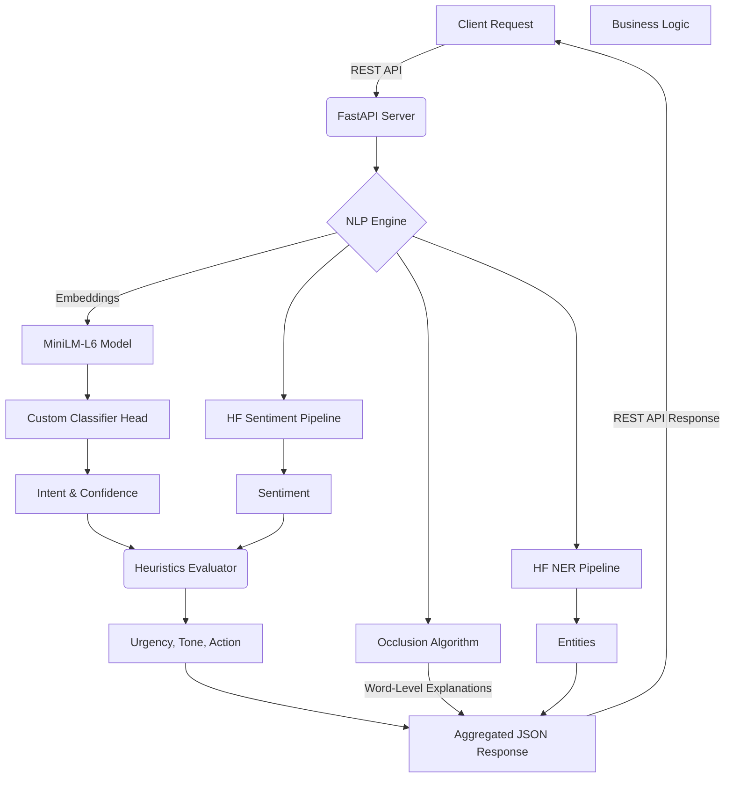

# Semantic Comment Analysis Platform

A high-performance, production-ready Natural Language Processing (NLP) pipeline for the semantic analysis of customer feedback, support tickets, and open-ended text. The system leverages state-of-the-art transformer models for embedding extraction, intent classification, sentiment analysis, and named entity recognition, layered with an Explainability Engine and Business Heuristics.

## Core NLP Capabilities

### 1. Intent Classification & Embeddings
The engine abandons slow zero-shot classification in favor of a fast, custom-trained classifier head:
- **Embeddings**: Uses **Sentence Transformers** (`all-MiniLM-L6-v2`) to map incoming text into a highly dense semantic vector space.
- **Classification Head**: Embeddings are passed through a lightweight Logistic Regression / SVM head (`local_model_head.pkl`) capable of handling thousands of requests per second with high accuracy.
- **Dynamic Labels**: Supports dynamic classification (e.g., Bug Report, Complaint, Feature Request, Praise, Question).

### 2. Multi-Intent Explainability (Occlusion Engine)
To eliminate the "black box" nature of machine learning predictions, the system implements a custom Occlusion-based Explainability Algorithm:
- Iteratively masks (occludes) every single word in a given text.
- Re-runs the classification head for each masked variation to measure confidence delta.
- Calculates exact word-level contributions, revealing precisely which vocabulary pushed or pulled the model toward a specific intent.

### 3. Sentiment & Entity Extraction
- **Sentiment Analysis**: Leverages robust Hugging Face Transformers (`pipeline("sentiment-analysis")`) to provide high-confidence Positive/Negative/Neutral classifications.
- **Named Entity Recognition (NER)**: Extracts critical entities (`pipeline("ner")`) such as Organizations, Locations, and Persons to provide contextual metadata alongside the semantic analysis.

### 4. Business Heuristics Layer
ML predictions are fed into a deterministic `evaluation.py` module to extract actionable business insights:
- **Urgency Detection**: Flags high-priority tickets based on sentiment depth and specific intent triggers.
- **Tone Mapping**: Translates raw ML sentiment arrays into human-readable customer tones (e.g., Frustrated, Satisfied, Neutral).
- **Recommended Actions**: Maps the final semantic profile to a standard operating procedure (e.g., "Escalate to Support", "Route to Product Team").

## System Architecture

The application is built on a decoupled architecture, exposing a high-performance **FastAPI** REST interface.



## Directory Structure

```text
Semantic-Comment-Analyze/
├── src/
│   ├── api/
│   │   └── server.py         # FastAPI application and endpoint routing
│   ├── engine/
│   │   ├── nlp_engine.py     # Transformer models, occlusion, and inference logic
│   │   ├── topic_modeler.py  # Unsupervised topic clustering
│   │   └── evaluation.py     # Business heuristics (Urgency, Tone, Actions)
│   └── data/
│       └── data_handler.py   # High-throughput CSV/Batch processing
├── data/
│   ├── local_model_head.pkl  # Trained classifier weights
│   └── label_mapping.txt     # Dynamic intent labels
├── tests/                    # Pytest suite
├── requirements.txt          # Python dependencies
└── pyproject.toml            # Project configuration
```

## Getting Started

### Prerequisites
- **Python 3.13+**
- **4GB+ RAM** (Models are cached locally after initial download)

### 1. Environment Setup
```bash
# Using uv (Recommended)
uv sync

# Or using standard pip
python -m venv .venv
.venv\Scripts\activate
pip install -r requirements.txt
```

### 2. Running the NLP Server
Start the FastAPI server via Uvicorn:
```bash
python -m uvicorn src.api.server:app --reload
# App will be accessible at http://127.0.0.1:8000
```

## API Integration

The core endpoint `POST /api/analyze` accepts raw text and returns rich, structured JSON, making it trivial to integrate this engine into existing microservices, data lakes, or support portals.

**Example Request**:
```json
{
  "text": "The app crashes every time I try to upload a PDF file!"
}
```

**Example Response**:
```json
{
  "intent": "Bug Report",
  "confidence": 0.94,
  "sentiment": "NEGATIVE",
  "urgency": "High",
  "tone": "Frustrated",
  "recommended_action": "Escalate to Engineering",
  "entities": [],
  "explanation": [
    {"word": "crashes", "contribution": 0.42, "primary_intent": "Bug Report"},
    {"word": "every", "contribution": 0.12, "primary_intent": "Bug Report"}
  ]
}
```
